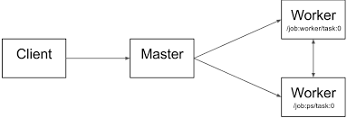

# MiniKuber: A Simplified Kubernetes-Based Task Scheduling System

## Introduction
MiniKuber is a simplified task scheduling system inspired by Kubernetes. In this project, a client connects to the master server and requests the execution of tasks. The master server then schedules tasks to available worker nodes based on their capacities. Note that the primary focus of this exercise is task scheduling, and actual task execution and result reporting are not part of the scope.

## Cluster Structure and Communication
The overall cluster structure and communication between services are depicted in the diagram below:



### Components:
1. **Master Server**:
   - Responsible for managing the cluster.
   - Records user-submitted tasks.
   - Decides which node (worker) to schedule each task on.
   - Maintains lists of worker nodes and task statuses (running or pending).

2. **Worker Nodes**:
   - Execute tasks assigned by the master.
   - Each worker node has limited capacity.
   - Identified by a unique ID chosen by the master.
   - Only accessible by the master (clients cannot directly send requests to workers).

3. **Client**:
   - Connects to the master server.
   - Submits requests to create, delete, or view tasks.
   - Receives appropriate responses from the master.

## Getting Started
1. Start the master server, which listens on a specified port.
2. Run worker programs, which send a registration request to the master, introducing themselves as workers.
3. Upon successful registration, the worker nodes are added to the cluster's list of workers.
4. Define a variable named `MAX_TASK_NUMBER` in the worker program to indicate the maximum number of tasks a worker can handle.
5. Clients can now send requests to the master server.

## Commands
Your program should handle the following commands when entered by the client:

1. **Create a New Task**:
   ```
   k create task --name=task1
   ```
   - If the master can schedule the task (i.e., sufficient available capacity), it creates the task (regardless of the worker).
   - Displays a success message along with the worker where the task is scheduled.
   - If there's insufficient capacity, the task remains in a pending state until space becomes available.
   - When space is available, the master schedules the pending task (using a FIFO policy).
   - When a new task is scheduled on a worker, log the event in the worker's stdout (e.g., "Task1 scheduled on WorkerX at timestamp").
   - If a task with the same name already exists in the cluster, display an appropriate message to the client.

2. **Create a Task on a Specific Node**:
   ```
   k create task --name=task1 --node=worker1
   ```
   - Schedules task1 specifically on the worker with ID=worker1.
   - If the task name already exists or the specified worker does not exist, display an appropriate message.

3. **List All Tasks**:
   ```
   k get tasks
   ```
   - Lists all tasks in the cluster, including their names, statuses (running or pending), and the worker where they are scheduled.
   - If no tasks are scheduled, display an appropriate message.

4. **List All Worker Nodes**:
   ```
   k get nodes
   ```
   - Lists all worker nodes, including their IDs and addresses (IP and port).
   - If no worker nodes exist, display an appropriate message.

5. **Delete a Task**:
   ```
   k delete task --name=task1
   ```
   - Deletes the task with the specified name from the cluster.
   - If the task does not exist, display an appropriate message.

6. **Worker Management**:
   --enabling/disabling workers, load balancing, and handling worker failures.

## Error Handling
If the user enters an invalid command format, display:
```
wrong command!
```
